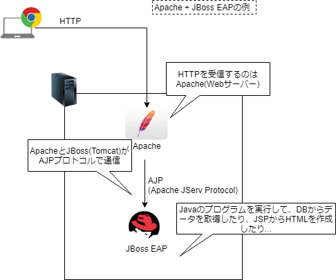

### Webアプリケーションについて #1
---
## 目的
- Webアプリケーションがどのように動作しているのかを知る
- Webアプリケーションの技術要素について知る
---
## 目的
### なぜ知る必要があるのか
- 実装漏れを防ぐことができない
- 問題点を早期発見することができない
- トラブルシューティングができない
---
## Webアプリケーションを作るためには何をすればいいのか
- インフラの調達
- アプリケーション開発
- デプロイ・運用
---
## 今回の内容
- C/SとWeb
- インフラ(WebAPサーバー、ロードバランサー)
- デプロイ
---
#### 比較: C/S

---
#### 比較: Web

---
## 何が違うのか
---
## C/S
### メリット
- クライアントにも処理を負担させるのでサーバの負荷を分散できる
- サーバとの通信量は比較的少ないので回線への負荷が少ない
- 細かい仕様の要件でもプログラムを作りやすい
---
## C/S
### デメリット
- バグなどの対応でバージョンアップのたびにクライアント側のソフトの入れ替えが必要
---
## Web
### メリット
- WEBブラウザがあれば利用可能なので、比較的幅広い端末で利用ができる
- システム更新時のクライアント側の作業の負担が少ない
---
## Web
### デメリット
- 処理のほとんどをWebAPサーバーで行うので、サーバーへの負荷が高い
- ブラウザの仕様の制限で柔軟な開発ができない
- サーバとの通信量が増えるので回線への負荷が高い
---
## インフラ
---
- Webアプリケーションサーバー
- ロードバランサー
---
## Webアプリケーションサーバー
### 役割
- クライアントのリクエストに対して適切なレスポンスを返却する
---
## WebサーバーとAPサーバー
- @fa[quote-left](何が違うのか →　レイヤーが違う)
---
## WebサーバーとAPサーバー
### Web3層
- Webサーバ層
- Webアプリケーション層
- データベース層
---
## WebサーバーとAPサーバー
### Web3層
####  Webサーバ層
- Webブラウザからのアクセス要求を処理する層。 必要に応じて、Webアプリケーション層へリクエストを要求する 
リクエストに応じて、サーバー内の静的なコンテンツやWebアプリケーション層の実行結果をレスポンスする
---
## WebサーバーとAPサーバー
### Web3層
####  Webアプリケーション層
- バックエンドで動作するプログラム(JavaやPHP、Rubyなど)を実行したり、データベースへのアクセスを行ない、処理を行う 実行結果をWebサーバー層へ返却する
---
## WebサーバーとAPサーバー
### Web3層
- Webサーバー → Webサーバー層
  * Apache, Nginx, IIS
 
- APサーバー →　Webアプリケーション層
  * Tomcat, Jboss, GlassFish(Javaの場合)
---
## WebサーバーとAPサーバー
- WebサーバーとAPサーバーは下図のように結びついている

---
## WebサーバーとAPサーバー
WebサーバーとAPサーバー(、DBサーバー)は物理的に分けることもできるが、それぞれのミドルウェアを同じサーバーに入れることでひとつにすることもできる
---
## ロードバランサー
### 役割
- サーバーの負荷分散を行いつつ、冗長化を実現する
---
## ロードバランサー
- WebはC/Sに比べてサーバーに大きく負荷がかかる
 - データ以外にも、HTML,CSS,JSを順次取得する必要があるため
- サーバーへの負荷が高まると、応答速度が遅くなるなどサービスレベルの低下につながる
---
## ロードバランサー
- よってWebアプリケーションは以下の能力を求められる
  * サーバーの能力が不足してきたときに容易に拡張できる(拡張性)
  * 故障が発生してもサービスが停止しない(可用性)
- 負荷分散+冗長化によってこれらの能力を実現する
---
## ロードバランサー

---
## ロードバランサー
### どのようにバランス先のサーバーを決めるのか
- ラウンドロビン
  * #1→#2→...と順番にバランスする
- 最小コネクション数
  * 一番接続数の少ないサーバを使う
---
## ロードバランサー
### 冗長化
ロードバランサーはバランス先のサーバーを決める際、ヘルスチェック(死活監視)を行い、問題ないと判断したサーバーにのみバランスするため、負荷分散だけではなく冗長化の側面も担っている
---
## ビルドとデプロイ
### ビルド
- コンパイル＋リンク

### コンパイル
- プログラムを機械語に翻訳

### リンク
- コンパイルされたファイルを1つの実行ファイルにまとめる
---
## ビルドとデプロイ
### デプロイ
- ビルドしてできた実行ファイルを、実行する環境に合わせて、実際に実行できるようにする
---
ex)  
ビルド = warファイルを作ること 
デプロイ = warファイルをJBoss EAPに配置すること 

---
### お疲れ様でした
