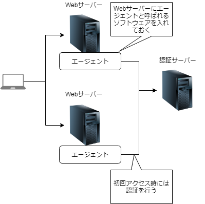

### Webアプリケーションについて #2
---
## 今回の内容
- SSO(シングルサインオン)
- WebAPサーバー⇔データベースサーバー
- シングルページアプリケーション
---
## SSO(シングルサインオン)
---
### SSO(シングルサインオン)
複数のサービスを一つの認証で利用できるようにする仕組み
 - 複数のサービスに関して複数のアカウント・パスワード情報を用意する必要がなくなる
 - 一度認証を行えば、関連するサービスの認証をする必要がなくなる
---
### SSO(シングルサインオン)
- エージェント方式
- リバースプロキシ方式
- 代理認証方式
- フェデレーション方式
---
### エージェント方式

---
### エージェント方式
#### メリット
- ネットワーク構成を変更しなくてもいい

#### デメリット
- エージェントのインストールが必要
- クッキーを制限している場合は使用できない
---
### リバースプロキシ方式

※リバースプロキシ=特定のサーバへの要求を必ず経由するように設置された代理サーバ
---
### リバースプロキシ方式
#### メリット
- エージェントのインストールが不要
- クッキーを利用しなくて良い

#### デメリット
- 認証サーバを経由しないとWebサーバにアクセスできないよう、ネットワーク構成の変更が必要
- 認証サーバーのアクセスが集中し、負荷が高まる
---
## WebAPサーバー⇔データベースサーバー
---
### WebAPサーバー⇔データベースサーバー
- データソース
- JNDI
- O/Rマッパー
---
### データソース
データベースへのアクセスを提供する機能
- コネクションプール
  * データベースへ接続するときに接続状態をプールし、コネクションを再利用することでデータベースへの接続を短縮する
- 分散トランザクション
  * 複数データベースにまたがるような処理をひとつのトランザクションとして扱える
---
### JNDI
オブジェクトにキーを紐づけて取り出せるようにするAPI
- オブジェクトとして登録できるものの中にデータソースも含まれる

---
### JNDI
プログラムの中から具体的な接続先やユーザー名などの情報を排除できる
→ 例えば接続先情報を変更したい要件が発生してもプログラムを直す必要がなくなる
---
### お疲れ様でした
